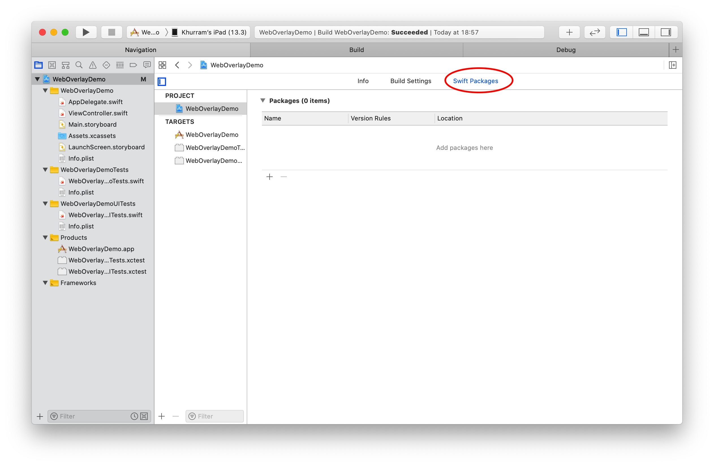
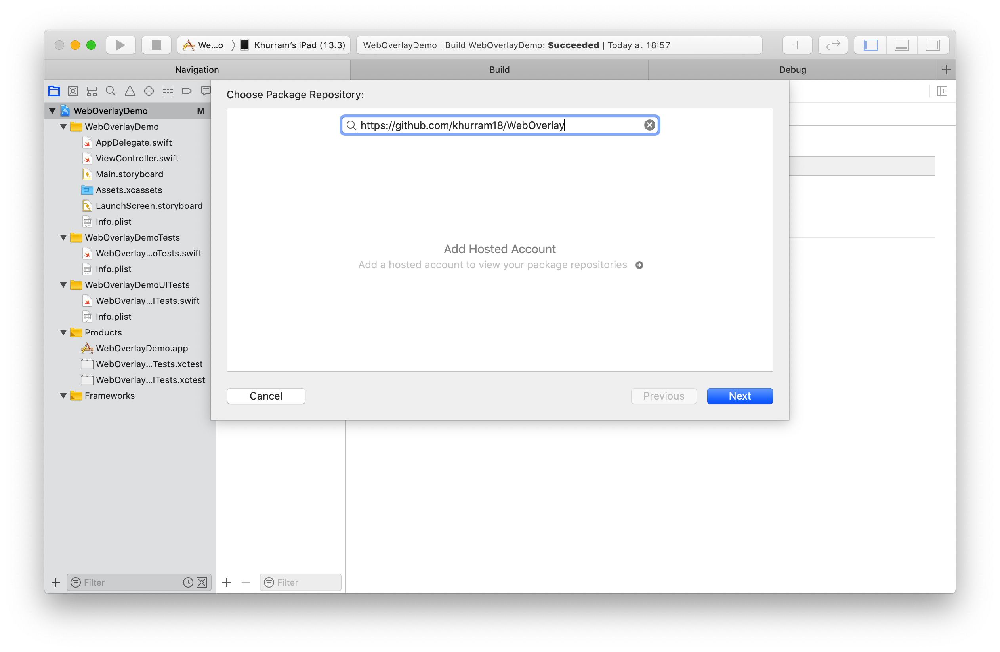
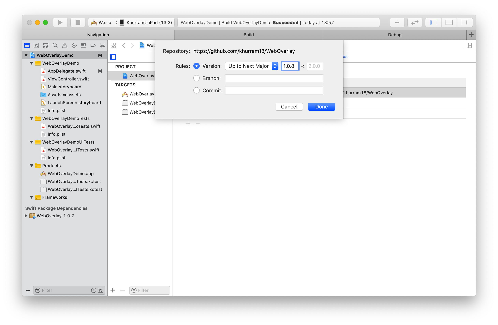
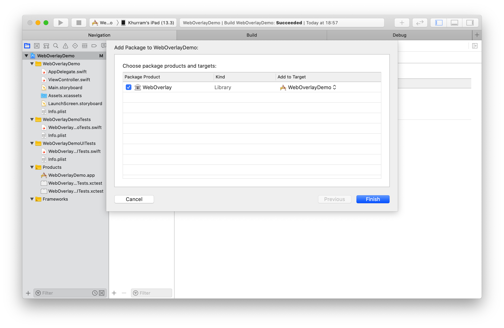

# WebOverlay
An iOS framework to render web content overlay over any app.
### How To Use the Library in Other App:
1. Open xcode project of you app.
2. Select the xcode project file and go to Swift packages tab


3. Tap on + button from packages section and mention `https://github.com/khurram18/WebOverlay` in textfield on Choose Package Repository window and click next.


4. On the next screen in rules scrion select Version, select Up to Next Major from drop down and wrote 1.0.8 in version field and click next.


5. Check WebOverlay from Choose package products and targets screen and select your app appropriate target and then click finish.


6. In side your `AppDelegate` class add import statement
```import WebOverlay```
7. Also in `AppDelegate` in `application(didFinishLaunchingWithOptions:)` and in `applicationWillEnterForeground` methods call 
```WebOverlay.sharedInstance.start(with:)```
8. Whenever you need to show the web overlay just call 
```WebOverlay.sharedInstance.show()```
i.e inside your button action method
```
@IBAction func showButtonTap(_ sender: Any) {
  WebOverlay.sharedInstance.show()
}
```

A sample demo app can be found at https://github.com/khurram18/WebOverlayDemo 
